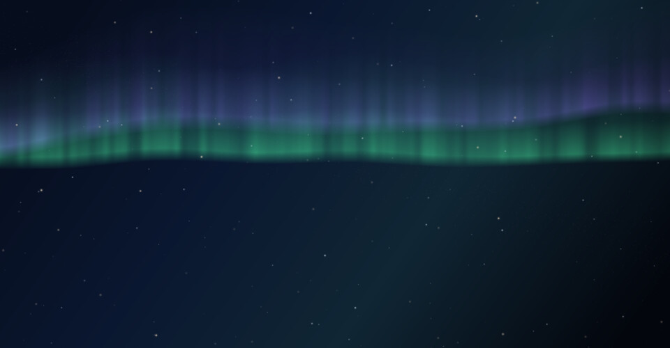
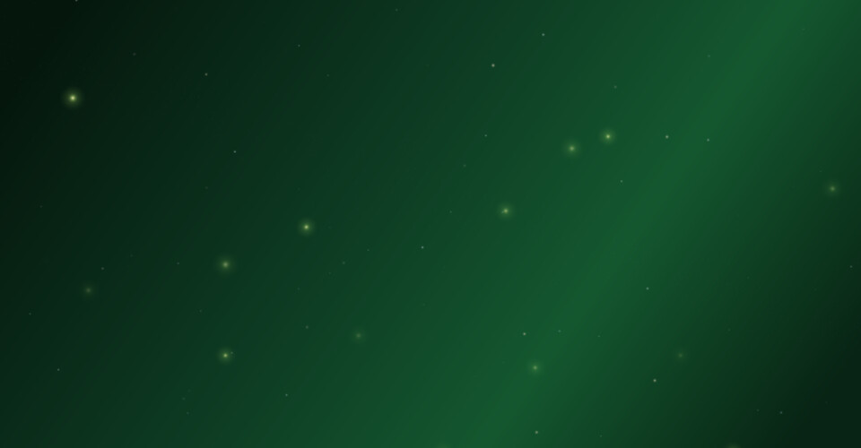
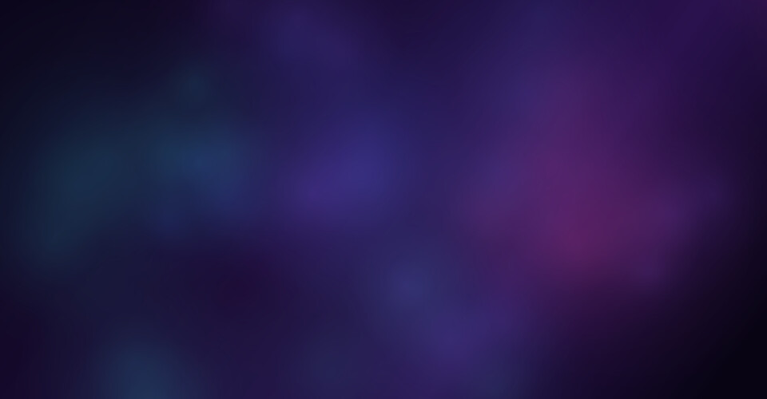
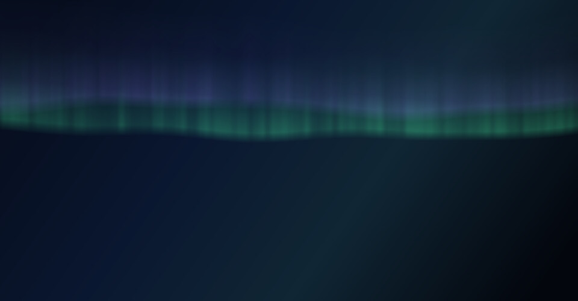
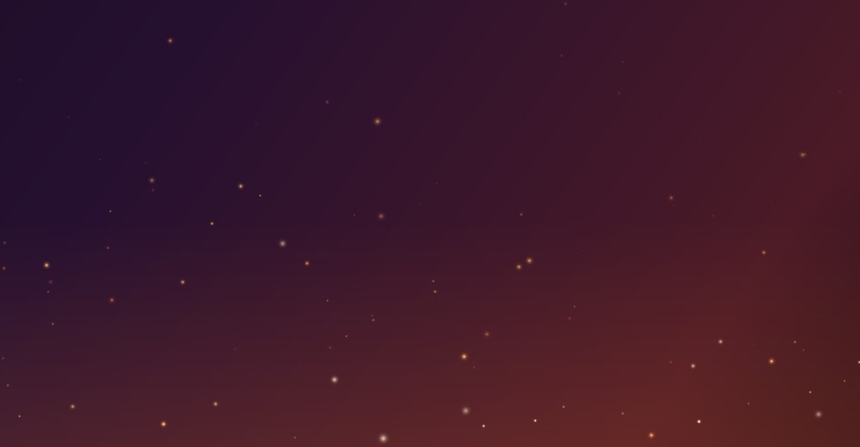
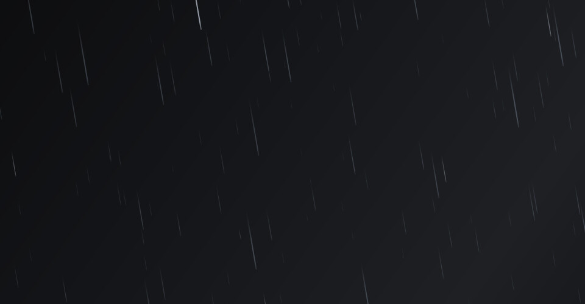

<div align="center">

# Wallpaper Engine

**Animated wallpapers for GNOME, drawn by your GPU.**

Aurora, nebulae, starfields, snow, rain and more: twelve patterns you can stack,
painted straight onto the desktop behind your windows.<br>
No extra window, no video file, and next to no CPU.


<sub>*Deep Space*: nebula clouds, a starfield and drifting constellations, with a meteor on its way through.</sub>

</div>

## Scenes

Each scene sets the patterns, how they're tuned and the background, all in one
click. Nine come built in, and you can save your own. These are still frames;
on your desktop every one of them moves.

<table>
  <tr>
    <td align="center" width="33%"><br><b>Classic</b><br><sub>The wave and its sparkles over deep blue</sub></td>
    <td align="center" width="33%"><br><b>Accent</b><br><sub>The wave and its sparkles in your accent colour</sub></td>
    <td align="center" width="33%"><br><b>Northern Lights</b><br><sub>Aurora curtains over a starry polar sky</sub></td>
  </tr>
  <tr>
    <td align="center"><br><b>Deep Space</b><br><sub>Nebula clouds, stars and drifting constellations</sub></td>
    <td align="center"><br><b>Campfire</b><br><sub>Embers rising through soft out-of-focus light</sub></td>
    <td align="center"><br><b>Snowfall</b><br><sub>A quiet snowfall on a winter night</sub></td>
  </tr>
  <tr>
    <td align="center"><br><b>Rainy Evening</b><br><sub>Fine rain in front of blurred distant lights</sub></td>
    <td align="center"><br><b>Summer Night</b><br><sub>Fireflies under a few faint stars</sub></td>
    <td align="center"><br><b>Topography</b><br><sub>A living relief map in your accent colour</sub></td>
  </tr>
</table>

## Patterns

Twelve patterns, and you can turn on any combination of them. Each one is shown
here by itself, over the palette it's usually paired with. Some are cropped in
close, and Starfield, Sparkles and Embers have their Amount and Brightness turned
up so they're visible at this size.

<table>
  <tr>
    <td align="center" width="33%"><br><b>Nebula</b><br><sub>Slow clouds of violet, teal and magenta light</sub></td>
    <td align="center" width="33%"><br><b>Aurora</b><br><sub>Curtains of polar light, streaked with rays</sub></td>
    <td align="center" width="33%"><br><b>Contours</b><br><sub>Topographic lines of a slowly shifting landscape</sub></td>
  </tr>
  <tr>
    <td align="center"><br><b>Starfield</b><br><sub>Layered stars, a galactic band and meteors</sub></td>
    <td align="center"><br><b>Wave</b><br><sub>Folded sheets of light with bright crests</sub></td>
    <td align="center"><br><b>Constellation</b><br><sub>Drifting points that link up when they meet</sub></td>
  </tr>
  <tr>
    <td align="center"><br><b>Sparkles</b><br><sub>Drifting, depth-scaled specks with a soft flare</sub></td>
    <td align="center"><br><b>Embers</b><br><sub>Sparks rising and cooling from white to red</sub></td>
    <td align="center"><br><b>Fireflies</b><br><sub>Warm lights wandering and blinking slowly</sub></td>
  </tr>
  <tr>
    <td align="center"><br><b>Bokeh</b><br><sub>Out-of-focus lights rising and fading</sub></td>
    <td align="center"><br><b>Snow</b><br><sub>Flakes at several depths, swaying in the wind</sub></td>
    <td align="center"><br><b>Rain</b><br><sub>Fine slanted streaks, the near drops faster</sub></td>
  </tr>
</table>

## Features


- **Stack any patterns and tune each one.** Every pattern has its own brightness
  and speed, and most let you set how much of it there is. Overall speed and
  opacity apply on top.
- **Any base.** Use your own wallpaper, a gradient in GNOME's accent colour, one
  of eight palettes, or any picture.
- **It shows up wherever your wallpaper does.** That includes the overview, the
  workspace switcher, and extensions that blur the background.
- **Built for multiple monitors.** Each monitor runs at its own refresh rate,
  or you can span one picture across all of them.
- **Light on the machine.** On a GTX 1080 at 1080p, each pattern takes 0.1–0.65 ms
  of GPU time per frame, and the whole thing uses about 4% of one CPU core.
  It uses nothing at all while windows cover the desktop, in power-saver mode,
  with animations turned off, or on battery if you choose.

<br clear="right">

## Install

It isn't on extensions.gnome.org yet, so install it from source. You need
GNOME Shell 45–50, `make`, and `glib-compile-schemas` (which comes with GLib).

```bash
git clone https://github.com/Jackicus/Gnome-Extension-Wallpaper-Engine.git
cd Gnome-Extension-Wallpaper-Engine
make install
```

GNOME Shell only looks for new extensions when you log in. Log out, log back in,
then turn it on:

```bash
gnome-extensions enable wallpaper-engine@jackt
```

To choose a scene, open the settings in the Extensions app, or run
`gnome-extensions prefs wallpaper-engine@jackt`.

To update, run `git pull && make install`, then log out and back in. To remove
it, run `make uninstall`.

> [!NOTE]
> It has been built and tested on GNOME Shell 50. Versions 45–49 are listed as
> supported but haven't been tested yet. GNOME 51 dropped the effect that draws
> the patterns, so it needs a port. See [docs/compatibility.md](docs/compatibility.md).

## Development

```bash
make link      # install as links into src/, for development
make reload    # apply your edits to the running shell, no logout needed
make nested    # start a throwaway nested GNOME Shell, mirrored in a window
make check     # compile every pattern's shader offline
make bench     # time each pattern on your GPU
```

A pattern is a single GLSL function plus one line in `src/lib/catalog.js`.
[docs/patterns.md](docs/patterns.md) explains how to write one and what keeps it
cheap. The rest of [`docs/`](docs/) covers the shell internals the extension
depends on, compatibility, and publishing.

---

<sub>The background engine started out in [Slider-Overlay](https://github.com/jackt/Slider-Overlay).
This project is not affiliated with the Wallpaper Engine app on Steam.</sub>
