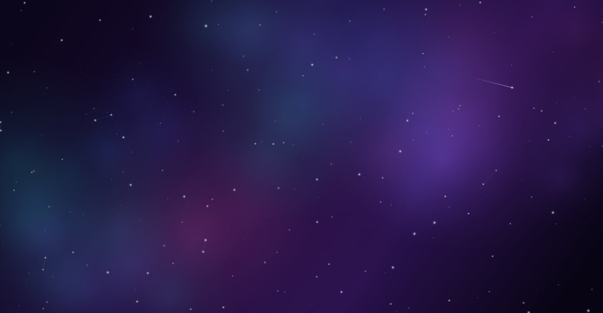
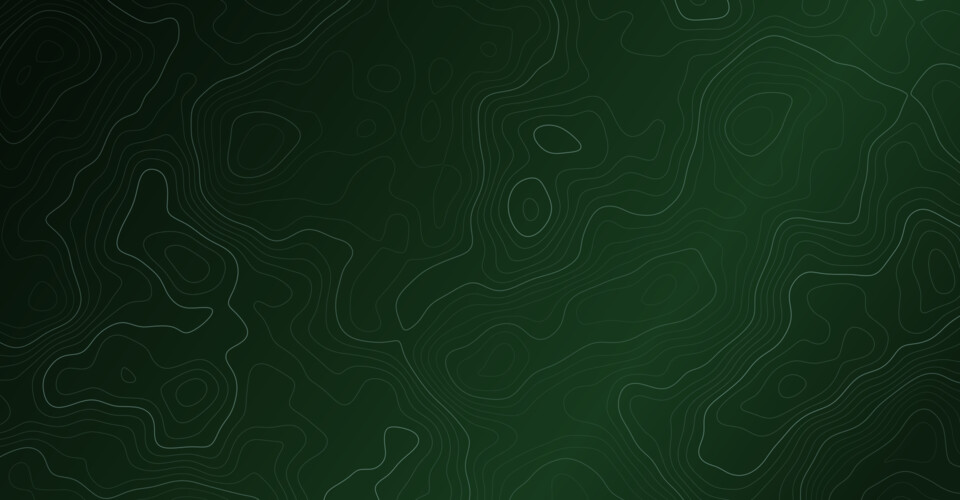
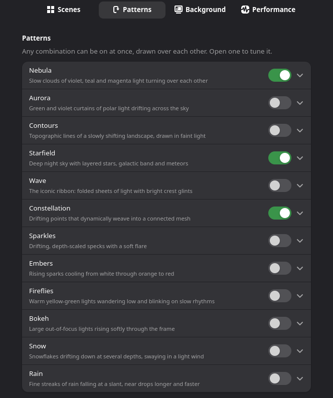

<div align="center">

# Wallpaper Engine

**Animated wallpapers for GNOME, drawn by your GPU.**

Aurora, nebulae, starfields, snow, rain and more: twelve patterns you can stack,
painted straight onto the desktop behind your windows.<br>
No extra window, no video file, and next to no CPU.



<sub>*Deep Space*: nebula clouds, a starfield and drifting constellations, with a meteor on its way through.</sub>

</div>

## Scenes

Each scene sets the patterns, how they're tuned and the background, all in one
click. Nine come built in, and you can save your own. These are still frames;
on your desktop every one of them moves.

<table>
  <tr>
    <td width="50%"><br><b>Northern Lights</b>: aurora curtains over a starry polar sky</td>
    <td width="50%"><br><b>Classic</b>: the wave and its sparkles over deep blue</td>
  </tr>
  <tr>
    <td width="50%"><br><b>Topography</b>: a living relief map in your accent colour</td>
    <td width="50%"><br><b>Snowfall</b>: a quiet snowfall on a winter night</td>
  </tr>
</table>

## Features



- **Twelve patterns, in any combination.** Nebula, Aurora, Contours, Starfield,
  Wave, Constellation, Sparkles, Embers, Fireflies, Bokeh, Snow and Rain. Each
  one has its own brightness and speed, and most let you set how much of it
  there is.
- **Any base.** Use your own wallpaper, a gradient in GNOME's accent colour, one
  of eight palettes, or any picture.
- **It shows up wherever your wallpaper does.** That includes the overview, the
  workspace switcher, and extensions that blur the background.
- **Built for multiple monitors.** Each monitor runs at its own refresh rate,
  or you can span one picture across all of them.
- **Light on the machine.** On a GTX 1080 at 1080p, each pattern takes 0.1–0.65 ms
  of GPU time per frame, and the whole thing uses about 4% of one CPU core.
  It uses nothing at all while windows cover the desktop, in power-saver mode,
  with animations turned off, or on battery if you choose.

<br clear="right">

## Install

It isn't on extensions.gnome.org yet, so install it from source. You need
GNOME Shell 45–50, `make`, and `glib-compile-schemas` (which comes with GLib).

```bash
git clone https://github.com/Jackicus/Gnome-Extension-Wallpaper-Engine.git
cd Gnome-Extension-Wallpaper-Engine
make install
```

GNOME Shell only looks for new extensions when you log in. Log out, log back in,
then turn it on:

```bash
gnome-extensions enable wallpaper-engine@jackt
```

To choose a scene, open the settings in the Extensions app, or run
`gnome-extensions prefs wallpaper-engine@jackt`.

To update, run `git pull && make install`, then log out and back in. To remove
it, run `make uninstall`.

> [!NOTE]
> It has been built and tested on GNOME Shell 50. Versions 45–49 are listed as
> supported but haven't been tested yet. GNOME 51 dropped the effect that draws
> the patterns, so it needs a port. See [docs/compatibility.md](docs/compatibility.md).

## Development

```bash
make link      # install as links into src/, for development
make reload    # apply your edits to the running shell, no logout needed
make nested    # start a throwaway nested GNOME Shell, mirrored in a window
make check     # compile every pattern's shader offline
make bench     # time each pattern on your GPU
```

A pattern is a single GLSL function plus one line in `src/lib/catalog.js`.
[docs/patterns.md](docs/patterns.md) explains how to write one and what keeps it
cheap. The rest of [`docs/`](docs/) covers the shell internals the extension
depends on, compatibility, and publishing.

---

<sub>The background engine started out in [Slider-Overlay](https://github.com/jackt/Slider-Overlay).
This project is not affiliated with the Wallpaper Engine app on Steam.</sub>
